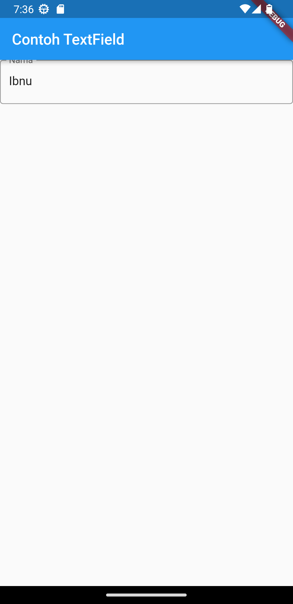
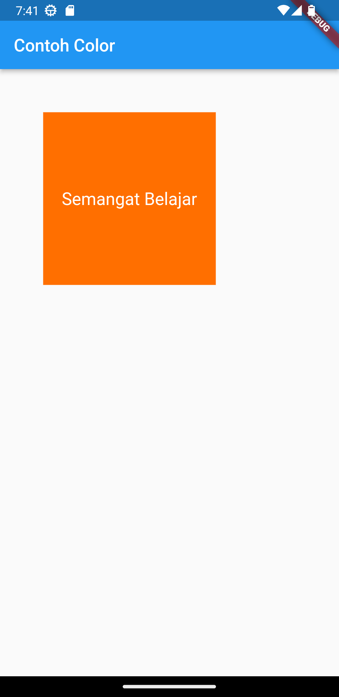

# basic_aplikasi_flutter

**Nama:** Ibnu Tsalis Assalam\
**NIM:** 2141762073\
**Kelas:** SIB-3E

Ini adalah repository untuk proyek Basic Aplikasi Flutter. Di dalamnya terdapat berbagai sub-bab yang menjelaskan konsep-konsep dasar Flutter dan contoh-contoh implementasinya.

## 2.5 Build in Widget

### [2.5.1 Text Widget](lib/main251_Text.dart)

```
flutter run -t lib\main251_Text.dart
```


### [2.5.2 Image Widget](lib/main252_Image.dart)

```
flutter run -t lib\main252_Image.dart
```


### [2.5.3 Material Design dan iOS Cupertino](lib/main253_Cupertino.dart)

```
flutter run -t lib\main253_Cupertino.dart
```


### [2.5.4 Button](lib/main254_Button.dart)

```
flutter run -t lib\main254_Button.dart
```


### [2.5.5 Scaffold](lib/main255_Scaffold.dart)

```
flutter run -t lib\main255_Scaffold.dart
```


### [2.5.6 Dialog](lib/main256_Dialog.dart)

```
flutter run -t lib\main256_Dialog.dart
```


### [2.5.7 Input dan Selection Widget](lib/main257_Input.dart)

```
flutter run -t lib\main257_Input.dart
```




### [2.5.8 Date and Time Pickers](lib/main258_DateTime.dart)

```
flutter run -t lib\main258_DateTime.dart
```


## 2.6 Build in Layout Widget

### 2.6.1 Container

#### [2.6.1.A. property child](lib/main261A_child.dart)

```
flutter run -t lib\main261A_child.dart
```


#### [2.6.1.B. property alignment](lib/main261B_alignment.dart)

```
flutter run -t lib\main261B_alignment.dart
```


#### [2.6.1.C. property color](lib/main261C_color.dart)

```
flutter run -t lib\main261C_color.dart
```



#### [2.6.1.D. property height dan width](lib/main261D_height_width.dart)

```
flutter run -t lib\main261D_height_width.dart
```


#### [2.6.1.E. property margin](lib/main261E_margin.dart)

```
flutter run -t lib\main261E_margin.dart
```


#### [2.6.1.F. property padding](lib/main261F_padding.dart)

```
flutter run -t lib\main261F_padding.dart
```


#### [2.6.1.G. property transform](lib/main261G_transform.dart)

```
flutter run -t lib\main261G_transform.dart
```


#### [2.6.1.H. property decoration](lib/main261H_decoration.dart)

```
flutter run -t lib\main261H_decoration.dart
```


### 2.6.2 Row dan Column

#### [Column](lib/main262_Colum.dart)

```
flutter run -t lib\main262_Colum.dart
```


#### [Row](lib/main262_Row.dart)

```
flutter run -t lib\main262_Row.dart
```


### [2.6.3 Stack](lib/main263_Stack.dart)

```
flutter run -t lib\main263_Stack.dart
```


---
