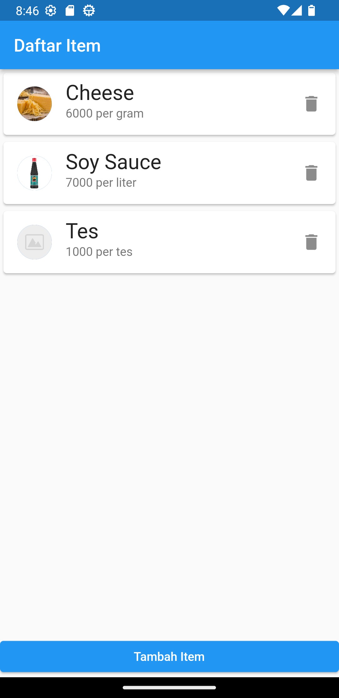
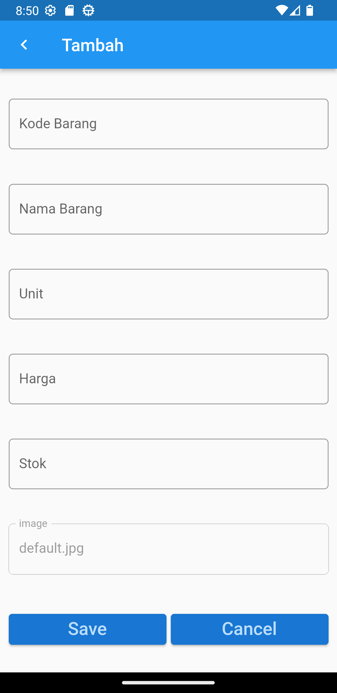

# flutter_navigasi_route

Ini Merupakan folder repository praktikum flutter navigasi dan route beserta database SQLite.

```
flutter run -t lib\main.dart
```

- route home1 menampilkan navigasi dengan List Item statik


<br>

- route home2 menampilkan navigasi dengan List Item dari dinamis Database SQLite





